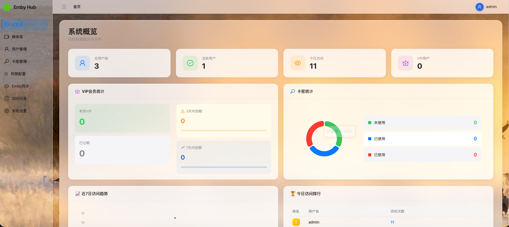
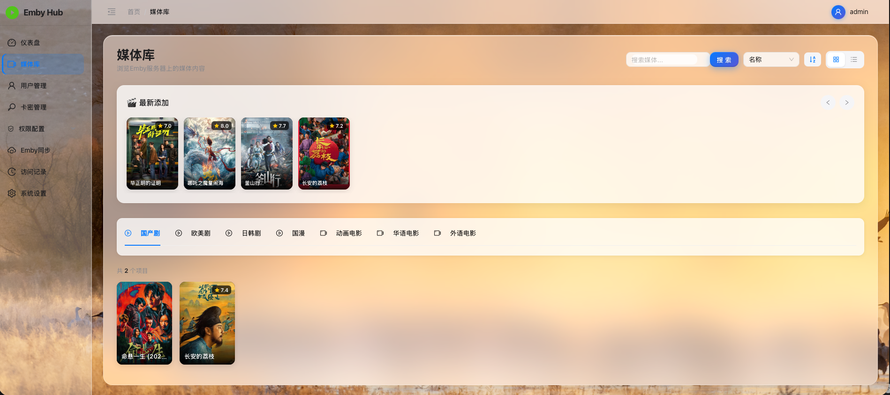
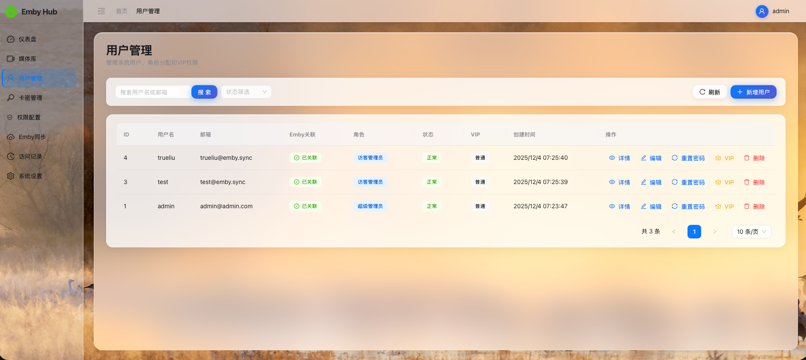
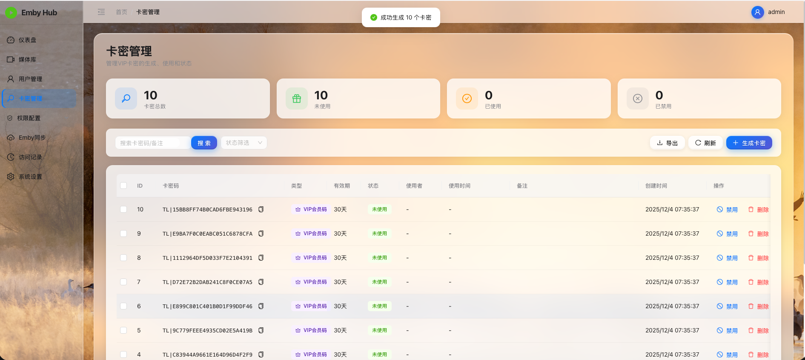

# Emby Hub - Emby用户管理系统

一套专为Emby媒体服务器设计的用户管理系统，支持集中管控用户账号、权限分配、VIP会员管理、访问行为追踪，并对接Emby原生API实现数据同步。

## 📸 系统截图

### 登录页面


### 系统概览


### 媒体库


### 用户管理


### 卡密管理


## 技术栈

### 前端
- **框架**: React 18 + TypeScript
- **UI组件库**: Ant Design 5.x
- **状态管理**: Redux Toolkit
- **路由**: React Router 6
- **HTTP客户端**: Axios
- **构建工具**: Vite

### 后端
- **框架**: Gin 1.9 (Go)
- **ORM**: GORM 2.x
- **数据库**: PostgreSQL 14+
- **缓存**: Redis 7.0+
- **认证**: JWT
- **日志**: Zap

## 功能特性

✅ **用户管理** - 创建、编辑、删除、查询用户，支持批量操作  
✅ **角色权限** - 灵活的角色权限体系，支持自定义权限分配  
✅ **VIP会员** - VIP等级管理，会员到期自动处理  
✅ **卡密系统** - 生成和管理VIP会员卡密，支持批量操作  
✅ **Emby同步** - 与Emby服务器双向同步用户数据  
✅ **媒体库** - 浏览Emby媒体库内容，按类型分类展示  
✅ **访问统计** - 实时统计用户访问行为，可视化数据展示  
✅ **系统配置** - 集中管理系统参数和Emby连接配置  
✅ **安装向导** - 首次运行自动引导配置，简化部署流程  
✅ **安全认证** - JWT Token认证，密码bcrypt加密  
✅ **权限控制** - 基于角色的访问控制（RBAC）

## 快速开始

### 使用启动脚本（推荐）

```bash
# 克隆项目
git clone <repository-url>
cd embyhub

# 一键启动所有服务
./start.sh

# 查看服务状态
./status.sh

# 停止所有服务
./stop.sh
```

服务将在以下端口启动：
- 前端: http://localhost:3001 (或 3000)
- 后端API: http://localhost:8080
- PostgreSQL: localhost:5432
- Redis: localhost:6379

### 使用Docker Compose

```bash
# 启动所有服务
docker-compose up -d

# 查看日志
docker-compose logs -f

# 停止服务
docker-compose down
```

### 本地开发

#### 1. 启动数据库

```bash
# 启动PostgreSQL和Redis
docker-compose up -d postgres redis

# 初始化数据库
psql -U embyhub -d embyhub -f database/init_schema.sql
psql -U embyhub -d embyhub -f database/init_data.sql
```

#### 2. 启动后端

```bash
cd backend

# 安装依赖
go mod download

# 运行
go run cmd/main.go
```

#### 3. 启动前端

```bash
cd frontend

# 安装依赖
npm install

# 开发模式运行
npm run dev
```

## 默认账号

首次启动系统后，使用以下账号登录：

- **用户名**: admin
- **密码**: Liubei00

⚠️ 请在首次登录后立即修改默认密码！

## 项目结构

```
embyhub/
├── backend/              # 后端Go项目
│   ├── cmd/             # 程序入口
│   ├── config/          # 配置管理
│   ├── internal/        # 内部代码
│   │   ├── dao/        # 数据访问层
│   │   ├── handler/    # 控制器
│   │   ├── middleware/ # 中间件
│   │   ├── model/      # 数据模型
│   │   ├── router/     # 路由
│   │   ├── service/    # 业务逻辑
│   │   └── util/       # 工具函数
│   └── pkg/            # 公共包
├── frontend/            # 前端React项目
│   ├── src/
│   │   ├── api/        # API接口
│   │   ├── components/ # 组件
│   │   ├── pages/      # 页面
│   │   ├── store/      # Redux状态
│   │   ├── types/      # TypeScript类型
│   │   └── utils/      # 工具函数
│   └── public/         # 静态资源
├── database/            # 数据库脚本
│   ├── init_schema.sql # 建表脚本
│   └── init_data.sql   # 初始数据
└── docker-compose.yml   # Docker编排配置
```

## API文档

启动后端服务后，访问 Swagger API 文档：
http://localhost:8080/swagger/index.html

## 配置说明

### 后端配置

编辑 `backend/config/config.yaml`:

```yaml
database:
  host: localhost
  port: 5432
  user: embyhub
  password: embyhub123
  dbname: embyhub

redis:
  host: localhost
  port: 6379
  password: ""

emby:
  serverUrl: http://your-emby-server:8096
  apiKey: your-emby-api-key
```

### 环境变量

也可以通过环境变量覆盖配置：

- `DB_HOST` - 数据库地址
- `DB_PORT` - 数据库端口
- `REDIS_HOST` - Redis地址
- `EMBY_SERVER_URL` - Emby服务器地址
- `EMBY_API_KEY` - Emby API密钥
- `JWT_SECRET` - JWT签名密钥

## Emby集成

### 1. 获取Emby API密钥

1. 登录Emby管理后台
2. 进入 "设置" → "高级" → "API密钥"
3. 创建新的API密钥并复制

### 2. 配置系统

在系统设置页面配置：
- Emby服务器地址（如: http://192.168.1.100:8096）
- API密钥
- 同步周期

### 3. 同步用户

- 手动同步：在Emby同步页面点击"立即同步"
- 自动同步：系统会按配置的周期自动同步

## 开发指南

### 添加新功能

1. 后端：在 `internal/handler`, `service`, `dao` 中添加相应代码
2. 前端：在 `pages` 中创建页面，在 `api` 中添加接口调用
3. 更新路由和权限配置

### 代码规范

- 后端：遵循Go标准规范，使用 `gofmt` 格式化
- 前端：遵循ESLint规则，使用Prettier格式化

## 性能优化

- ✅ Redis缓存热点数据
- ✅ 数据库索引优化
- ✅ 分页查询
- ✅ 前端路由懒加载
- ✅ Nginx静态资源缓存

## 安全性

- ✅ 密码bcrypt加密存储
- ✅ JWT Token认证
- ✅ CORS跨域配置
- ✅ SQL注入防护（GORM参数化查询）
- ✅ XSS防护（前端输入校验）

## 故障排查

### 数据库连接失败

检查PostgreSQL是否启动：
```bash
docker-compose ps postgres
```

### Redis连接失败

检查Redis是否启动：
```bash
docker-compose ps redis
```

### Emby同步失败

1. 检查Emby服务器地址是否正确
2. 验证API密钥是否有效
3. 查看后端日志：`docker-compose logs backend`

## 更新日志

### v1.0.0 (2024-12-03)
- 🎉 首次发布
- ✨ 用户管理功能
- ✨ 角色权限管理
- ✨ Emby数据同步
- ✨ 访问统计
- ✨ 系统配置

## 贡献指南

欢迎提交Issue和Pull Request！

## 许可证

MIT License

## 联系方式

如有问题，请提交Issue或联系维护者。
